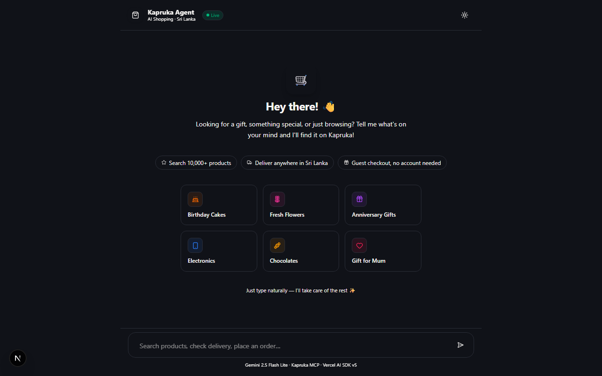
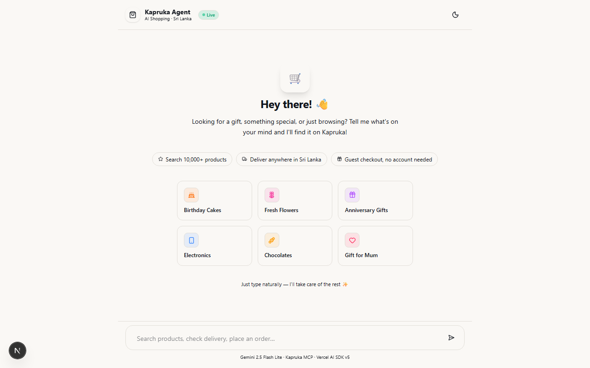
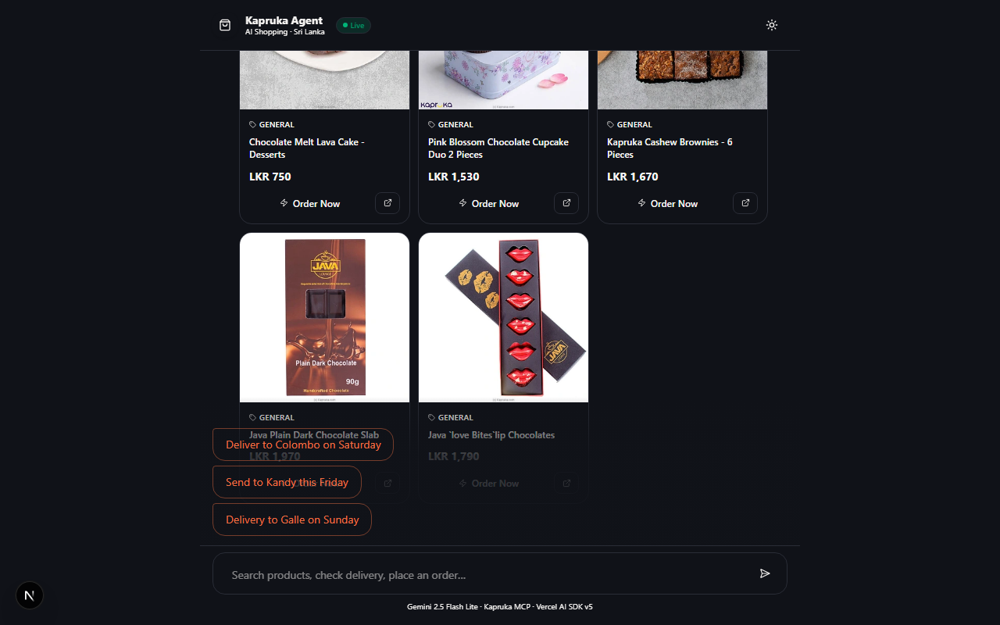
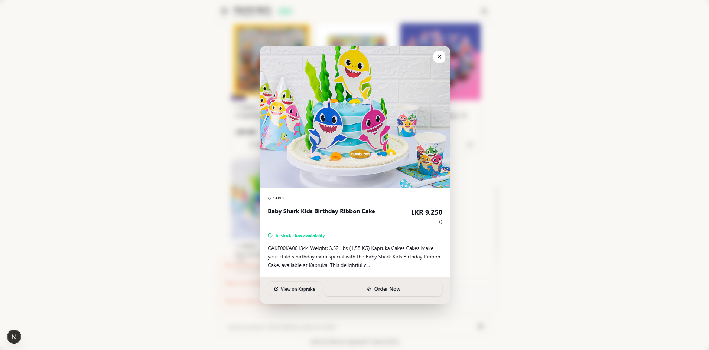
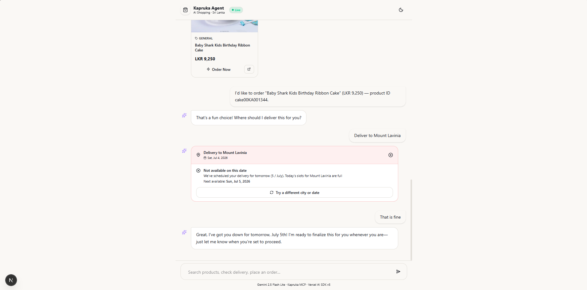
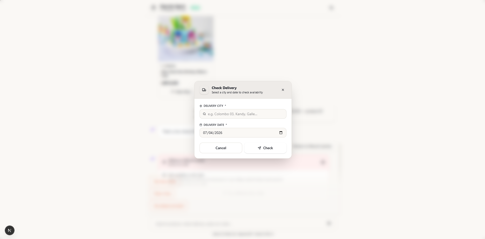

# Kapruka Agent

An AI-powered shopping assistant for [Kapruka.lk](https://www.kapruka.com) — Sri Lanka's favourite gifting platform. Built with Next.js, Vercel AI SDK v5, and Gemini 2.5 Flash, it lets users search products, check delivery, and place orders through a natural-language chat interface.

---

## Screenshots

| Welcome (Dark) | Welcome (Light) |
|:-:|:-:|
|  |  |

| Conversational AI + Quick-reply chips | Product Grid |
|:-:|:-:|
|  |  |

| Product Card | Check Availability |
|:-:|:-:|
|  |  |

| Change the delivery location & date |
|:-:|
|  |

---

## Features

- **Conversational shopping** — chat naturally to find gifts, cakes, flowers, and more
- **Live product search** — real-time catalog search with filtering (price, category, stock)
- **Delivery check** — verify delivery availability and cost to any city in Sri Lanka
- **One-click checkout** — generates a Kapruka click-to-pay order link from within the chat
- **Order tracking** — track any order by order number
- **Contextual quick-replies** — AI-generated suggestion chips after each response
- **Product detail modal** — full product view with images, variants, and attributes
- **Dark / light mode** — via `next-themes`, dark by default
- **Streaming responses** — token-by-token streaming with skeleton loading states

---

## Tech Stack

| Layer | Technology |
|-------|-----------|
| Framework | Next.js 16 (App Router) |
| Language | TypeScript (strict) |
| UI | React 19, shadcn/ui, Tailwind CSS v4 |
| AI | Vercel AI SDK v5, `@ai-sdk/google` |
| Model | Gemini 2.5 Flash (configurable) |
| Tools | Kapruka MCP server via `@ai-sdk/mcp` |
| Theming | `next-themes`, orange accent (`hsl(16 84% 60%)`) |

---

## Architecture

```
app/page.tsx
  └── components/chat/ChatShell.tsx       ← useChat hook, modal orchestration
        ├── components/chat/MessageList.tsx       ← renders messages + tool outputs
        ├── components/chat/InputBar.tsx          ← message input
        └── components/chat/SuggestedPrompts.tsx  ← welcome screen prompts

app/api/chat/route.ts     ← POST — streams Gemini responses with MCP tools
app/api/suggestions/      ← POST — generates contextual quick-reply chips
lib/mcp.ts                ← getMcpTools() — fresh MCP client per request
```

**Tool output rendering** (`MessageList.tsx`): tool call results are dispatched by tool name to dedicated UI components:

| MCP Tool | UI Component |
|----------|-------------|
| `kapruka_search_products` | `components/kapruka/ProductGrid.tsx` |
| `kapruka_check_delivery` | `components/kapruka/DeliveryQuote.tsx` |
| `kapruka_create_order` | `components/kapruka/CheckoutPanel.tsx` |

States cycle through: `input-streaming` (skeleton) → `output-available` (render) → `output-error`.

**Modal flow:**
1. User clicks "Order Now" on a product card → `ProductDetailModal` opens
2. AI collects city + date conversationally → `DeliveryCheckModal` for retries
3. AI asks for personal details → `OrderFormModal` opens automatically
4. Form data sent back to AI → `kapruka_create_order` → `CheckoutPanel` with payment link

---

## Kapruka MCP Tools

All tools are auto-discovered from `https://mcp.kapruka.com/mcp` — no manual registration needed.

| Tool | Purpose |
|------|---------|
| `kapruka_search_products` | Catalog search with filters (price, category, stock, sort) |
| `kapruka_get_product` | Full product details including variants and images |
| `kapruka_list_categories` | Browse top-level categories |
| `kapruka_list_delivery_cities` | Search the delivery network |
| `kapruka_check_delivery` | Verify delivery feasibility and cost for a city + date |
| `kapruka_create_order` | Generate a click-to-pay checkout link |
| `kapruka_track_order` | Monitor order status by order number |

> **Important:** All tool arguments must be wrapped in a `params` object and include `response_format: "json"`.

---

## Getting Started

### Prerequisites

- Node.js 18+
- A Google Gemini API key

### Installation

```bash
git clone https://github.com/ViroKalu/kapruka-agent.git
cd kapruka-agent
npm install
```

### Environment Variables

Create a `.env.local` file in the project root:

```env
GOOGLE_GENERATIVE_AI_API_KEY=your_gemini_api_key_here
KAPRUKA_MCP_URL=https://mcp.kapruka.com/mcp
AI_MODEL=gemini-2.5-flash
```

| Variable | Required | Description |
|----------|----------|-------------|
| `GOOGLE_GENERATIVE_AI_API_KEY` | Yes | Gemini API key from [Google AI Studio](https://aistudio.google.com/) |
| `KAPRUKA_MCP_URL` | Yes | Kapruka MCP server endpoint |
| `AI_MODEL` | No | Gemini model string (default: `gemini-2.5-flash`) |

### Development

```bash
npm run dev
```

Open [http://localhost:3000](http://localhost:3000) in your browser.

### Production Build

```bash
npm run build
npm run start
```

---

## Available Commands

```bash
npm run dev      # Start development server (http://localhost:3000)
npm run build    # Production build
npm run start    # Start production server
npm run lint     # ESLint
```

---

## Testing MCP Tools

A test script calls all MCP tools and prints raw responses:

```bash
node scripts/test-mcp.mjs
```

---

## Rate Limits (Kapruka MCP)

- 60 requests / minute per IP (all tools)
- 30 order creations / hour per IP
- 30-minute server-side cache for read operations

---

## Project Structure

```
kapruka-agent/
├── app/
│   ├── api/
│   │   ├── chat/route.ts          # Streaming chat endpoint
│   │   └── suggestions/           # Quick-reply suggestion endpoint
│   ├── layout.tsx
│   └── page.tsx
├── components/
│   ├── chat/
│   │   ├── ChatShell.tsx          # Main chat orchestrator
│   │   ├── MessageList.tsx        # Message + tool output rendering
│   │   ├── InputBar.tsx           # Message input
│   │   └── SuggestedPrompts.tsx   # Welcome screen
│   ├── kapruka/
│   │   ├── ProductGrid.tsx        # Product search results
│   │   ├── ProductDetailModal.tsx # Full product view
│   │   ├── DeliveryQuote.tsx      # Delivery availability card
│   │   ├── DeliveryCheckModal.tsx # Delivery retry form
│   │   ├── CheckoutPanel.tsx      # Order confirmation + payment link
│   │   └── OrderFormModal.tsx     # Recipient details form
│   ├── ui/                        # shadcn/ui components
│   └── ThemeSwitcher.tsx
├── lib/
│   ├── mcp.ts                     # MCP client factory
│   └── utils.ts                   # cn(), formatLKR(), truncate()
├── scripts/
│   └── test-mcp.mjs               # MCP tool test runner
└── public/
```

---

## Key Utilities (`lib/utils.ts`)

- `cn()` — Tailwind class merging via `clsx` + `tailwind-merge`
- `formatLKR(amount)` — formats numbers as Sri Lankan Rupees
- `truncate(str, length)` — safe string truncation

---

## License

Private repository — all rights reserved.
